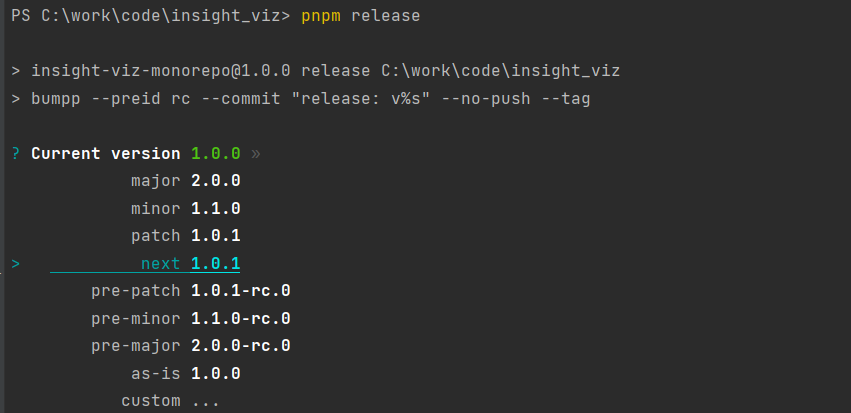
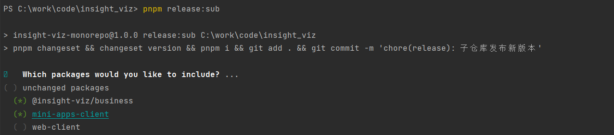

# 数据分析产品前端大仓

## 建议使用nvm安装node环境
[下载windows安装包](https://github.com/coreybutler/nvm-windows/releases)


### npm的版本应该大于7.x, 如果npm版本小于7.x或者husky没有生效应该手动执行
```shell
npx husky install
```


## 依赖安装
详情参考pnpm文档 https://pnpm.io/zh/installation
### 为整个项目安装依赖
```shell
pnpm i
```
### 全局依赖
如果依赖包在所有仓库中共享只需要安装一份（如vue、axios），那么我们应该安装到项目的根目录
```shell
pnpm add <package_name> -w
```

### 局部依赖
对于某些依赖，可能仅存在于某几个 package 中。为其中一个子仓库添加依赖 如`pnpm i @types/qs --filter web-client`
```shell
pnpm add <package_name> --filter <package_selector>
```
### link 机制
在 monorepo 中，我们往往需要 package 间的引用，比如本仓库中的`@/insight-viz/business`就会被`web-client`依赖。
我们可以使用类似于局部依赖中的方法安装：
```shell
pnpm add @insight-viz/business --filter web --workspace
```

## 仓库说明
子仓库如果是工具类型的仓库,在`package.json`中`name`的命名应该为`@/insight-viz/<子仓文件夹名>`
如`business`仓库命名为 `@/insight-viz/business`
```text
├── package.json
├── packages
│   ├── business            // 公共业务逻辑
│   ├── mini-apps-client    // 小程序项目
│   └── web-client          // pc端项目
├── pnpm-lock.yaml
└── pnpm-workspace.yaml
```

## 版本发布

### 产品版本发布
整个产品的版本发布以大仓版本version为准，新建release/vX.X.X分支执行以下命令: 选择发布的版本，该命令会自动commit并且标记`tag`
执行完命令以后推送到远端仓库，并且提交PR合并到`main`分支中
```shell
pnpm release
```

### 子仓库发布
子仓库使用changeset管理版本（不需要标记tag），从`main`分支中签出`issues/***`分支执行以下命令进行子仓库的版本发布

```shell
pnpm release:sub
```
使用`空格键`选择需要发布版本的子仓库，如果选中的子仓库被其他子仓库所引用则需要勾选上引用的子仓库一起发布(目的是为了将引用仓库的中的`package.json` 所引用的其他子仓库的依赖版本进行修改)
例如：`@insight-viz/business`被其 `mini-apps-client`所引用那么发布的时候应该同时勾选上这两个仓库一起发布,在成功commit之后推送到远端分支即可

